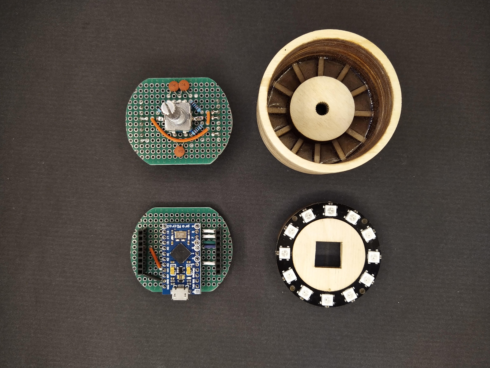
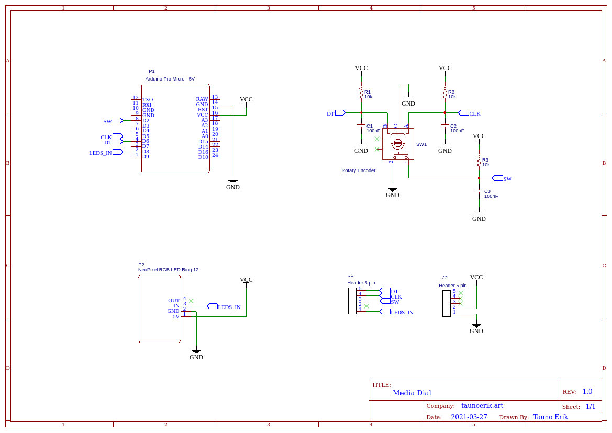

# Meedia-tsõõr

Tsõõri kujuline arvuti sisesndseade.

Arduino Pro Micro saab programmeerida matkima kõiki USB seadmeid. Nagu see oleks hiir, klaviatuur või mõni muu HID tüüpi USB seade.

## Kood

Kood on kataloogis [src/](src/).

Eraldi on loodud teek Rotary Encoderi jaoks kataloogis [lib/](lib/).

Kataloogis [include/](include/) on debug päisefail.

## Pildid

Pildid on kataloogis [img/](img/).

## Skeem

## Lühendid

HID - Human Interface Device.

USB - Universal Serial Bus. Universaalne jadasiin/järjestiksiin.

## Lingid

- https://learn.sparkfun.com/tutorials/pro-micro--fio-v3-hookup-guide
- https://learn.adafruit.com/atmega32u4-breakout/using-with-arduino
- http://www.fourwalledcubicle.com/LUFA.php
- https://github.com/abcminiuser/lufa

___

Copyright 2021 Tauno Erik [taunoerik.art](https://taunoerik.art)
